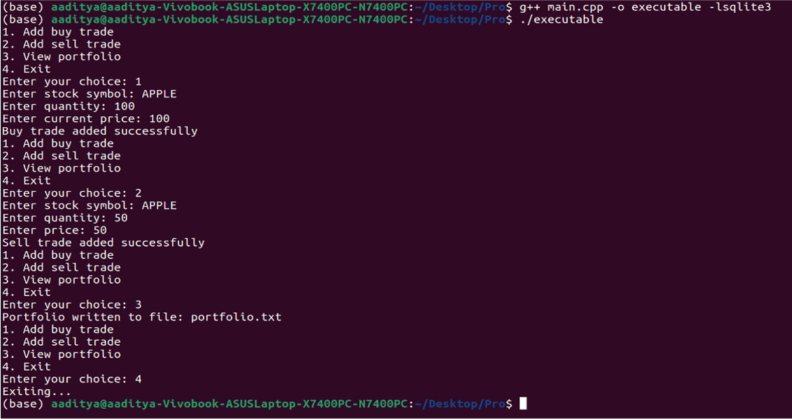
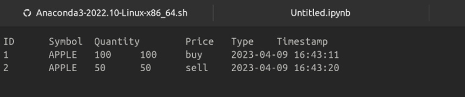

# Trading Management System

The Trading Management System is a project aimed at designing and developing a trading application that enables users to buy and sell stocks, monitor their portfolio, and view their transaction history.

## Objective

The objective of this project is to provide users with a user-friendly interface to manage their investments in the stock market efficiently. Whether users are seasoned investors or newcomers to trading, this application aims to simplify the process of buying, selling, and monitoring stocks.

## Features

- **Stock Trading**: Users can buy and sell stocks through the application.
- **Portfolio Monitoring**: Users can monitor the performance of their stock portfolio in real-time.
- **Transaction History**: Users can view a detailed history of their past transactions, including buy and sell orders.
- **User Authentication**: Secure user authentication ensures that only authorized users can access the trading platform.
- **Real-time Data**: Access to real-time stock market data for informed decision-making.
- **User-Friendly Interface**: Intuitive and easy-to-use interface for seamless navigation and trading experience.

## Installation

1. Clone the repository:

    ```bash
    git clone https://github.com/01ankon01/trading-management-system.git
    ```

2. Navigate to the project directory:

    ```bash
    cd trading-management-system
    ```

3. Compile the application:

    ```bash
    g++ main.cpp -o executables -lsqlite3
    ```

## Usage

1. Start the application:

    ```bash
    ./executables
    ```

2. Sign in or register as a new user.
3. Explore available stocks and their prices.
4. Buy or sell stocks based on your investment strategy.
5. Monitor your portfolio and track your transaction history.

## Technologies Used

- C++: Programming language used for backend development.
- SQLite: Database management system for storing user information and transaction data.
- API Integration: Integration with stock market APIs for real-time data.

## Contributors

- [Ankon Das](https://github.com/01ankon01)

## License

This project is licensed under the MIT License - see the [LICENSE](LICENSE) file for details.

## Acknowledgments

- Inspiration: Stock trading platforms
- Technologies: C++, SQLite

## Support

For any inquiries or support, please [open an issue](https://github.com/01ankon01/trading-management-system/issues) on GitHub.

## Here are some pictures





